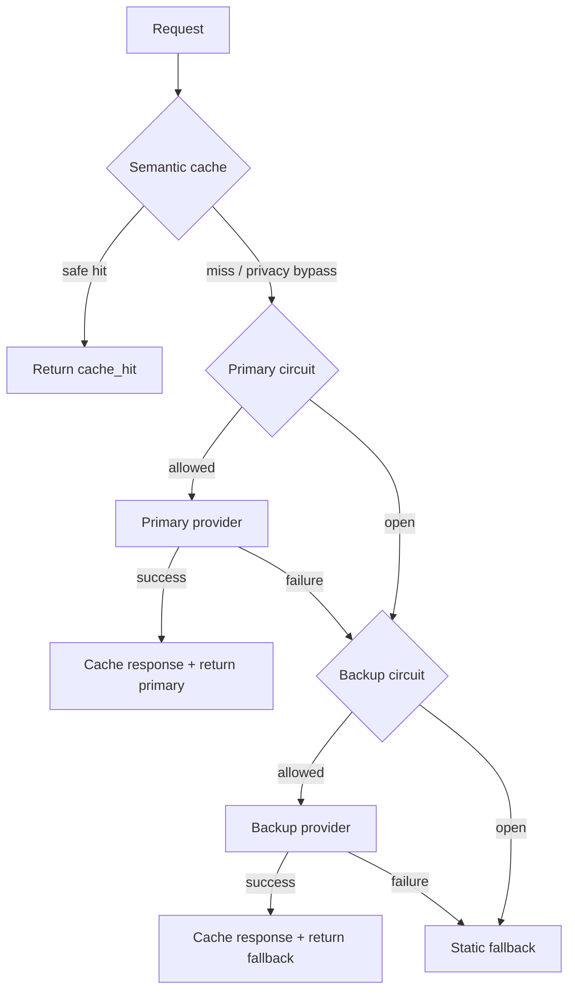

# Day 25 Reliability Engineering Final Report

## 1. Architecture summary

The gateway uses four defensive layers in order: semantic cache, per-provider circuit breakers,
a provider fallback chain, and a static fallback. Successful provider responses are cached; privacy-sensitive
queries bypass both cache reads and writes. Every response carries a `route` so the path can be audited.



The circuit breaker implements `CLOSED -> OPEN -> HALF_OPEN -> CLOSED`. A failed HALF_OPEN probe has
a distinct `probe_failure` transition reason, which separates recovery failures from ordinary threshold opens.

## 2. Configuration

| Setting | Value | Reason |
|---|---:|---|
| `failure_threshold` | 3 | Avoid opening on one transient failure while still stopping retry storms quickly. |
| `reset_timeout_seconds` | 2 s | Short enough for the lab to observe recovery while still enforcing fail-fast behavior. |
| `success_threshold` | 1 | One successful probe restores service quickly; production may require more probes to reduce flapping. |
| cache TTL | 300 s | Long enough to reuse FAQ/technical answers, but bounded so stale answers age out. |
| `similarity_threshold` | 0.92 | Intentionally strict because a false hit is more harmful than an extra provider call. |
| cache backend | memory | Used for the reproducible chaos metrics; the Redis implementation is validated separately. |
| load-test requests | 100/scenario | Three scenarios give 300 requests, matching the lab specification. |
| random seed | 25 | Makes query/provider randomness repeatable across runs; wall-clock latency can still vary slightly. |

The semantic cache additionally rejects privacy patterns at both `get()` and `set()`, and it rejects a
high-similarity match when four-digit years/numbers disagree.

## 3. SLO definitions

| SLI | SLO target | Actual value | Met? |
|---|---|---:|---|
| Availability | >= 99% | 99.00% | Yes |
| Latency P95 | < 2500 ms | 314.65 ms | Yes |
| Fallback success rate | >= 95% | 96.25% | Yes |
| Cache hit rate | >= 10% | 57.00% | Yes |
| Recovery time | < 5000 ms | 2206.17 ms | Yes |

## 4. Metrics

These values were generated by the chaos runner from three scenarios x 100 requests and are stored in
`reports/metrics.json`.

| Metric | Value |
|---|---:|
| total_requests | 300 |
| availability | 0.9900 |
| error_rate | 0.0100 |
| latency_p50_ms | 271.66 |
| latency_p95_ms | 314.65 |
| latency_p99_ms | 318.19 |
| fallback_success_rate | 0.9625 |
| cache_hit_rate | 0.5700 |
| estimated_cost | 0.056038 |
| estimated_cost_saved | 0.171000 |
| circuit_open_count | 10 |
| recovery_time_ms | 2206.17 |

## 5. Cache comparison

A second deterministic run used the same seed and scenarios with `cache.enabled = false`.

| Metric | Without cache | With cache | Delta |
|---|---:|---:|---:|
| availability | 0.9767 | 0.9900 | +0.0133 |
| latency_p50_ms | 265.14 | 271.66 | +6.52 ms |
| latency_p95_ms | 314.65 | 314.65 | 0.00 ms |
| estimated_cost | 0.134232 | 0.056038 | -0.078194 (-58.25%) |
| cache_hit_rate | 0.0000 | 0.5700 | +0.5700 |
| circuit_open_count | 20 | 10 | -10 |

The apparent P50 increase does not mean cache hits are slower. The current metric collector only appends
latency when `latency_ms > 0`, so zero-latency cache hits are excluded from the percentile sample. These
percentiles therefore describe provider-path latency, while cache effectiveness is visible through hit rate,
cost reduction, availability, and fewer circuit opens.

## 6. Redis shared cache

An in-memory cache is process-local. With three gateway replicas, the same query can be paid for three times
and each replica warms independently. `SharedRedisCache` stores a Redis hash containing both `query` and
`response`, applies `EXPIRE`, scans the shared prefix for semantic matching, and reuses the same privacy and
false-hit guardrails as the in-memory cache.

The repository includes `tests/test_redis_cache.py`, covering connectivity, exact get/set, TTL expiry,
shared state across two cache instances, privacy bypass, and different-year false-hit rejection.

A Docker-backed runtime check cannot be truthfully recorded from the execution sandbox used to prepare this
submission because that sandbox has neither Docker nor `redis-server`. The submission environment should run:

```bash
docker compose up -d
pytest tests/test_redis_cache.py -v
docker compose exec redis redis-cli KEYS "rl:cache:*"
```

The required acceptance condition is six Redis tests passing rather than being skipped. No Redis CLI output is
fabricated in this report.

## 7. Chaos scenarios

| Scenario | Expected behavior | Observed behavior | Pass/Fail |
|---|---|---|---|
| `primary_timeout_100` | Primary always fails; backup absorbs traffic; primary circuit opens. | Availability 1.00, fallback success 1.00, 7 circuit opens. | Pass |
| `primary_flaky_50` | Mixed primary/fallback traffic; circuit opens and later heals. | Availability 0.97, fallback success 0.9032, 3 opens, recovery 2206.58 ms. | Pass |
| `all_healthy` | No provider failures; no circuit opening. | Availability 1.00, 0 circuit opens, cache hit rate 0.59. | Pass |

`primary_timeout_100` has no recovery-time sample for its primary breaker because the forced 100% failure
continues to kill every probe; recovery is demonstrated by the flaky scenario instead.

## 8. Failure analysis

The largest remaining production weakness is that circuit-breaker state is still stored in each process.
With multiple pods, one pod can have an OPEN circuit while another continues sending traffic to the failing
provider, weakening retry-storm protection. Before production, breaker state should be coordinated through a
shared state/lease mechanism (for example Redis with atomic operations) or through a dedicated service-level
load-shedding layer.

A second measurement weakness is the provider-only latency percentile described in Section 5. I would record
both end-to-end latency (including zero/near-zero cache hits) and provider-attempt latency as separate SLIs.

## 9. Next steps

1. Share circuit-breaker state across replicas with atomic transitions and a single HALF_OPEN probe lease.
2. Add end-to-end latency and response-quality SLIs, then enforce explicit SLO gates in CI.
3. Add Redis outage fallback to in-memory cache plus concurrency/load tests using `ThreadPoolExecutor`.
